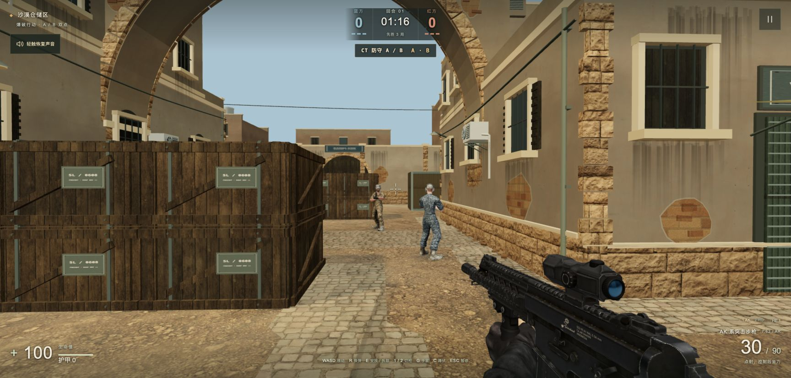
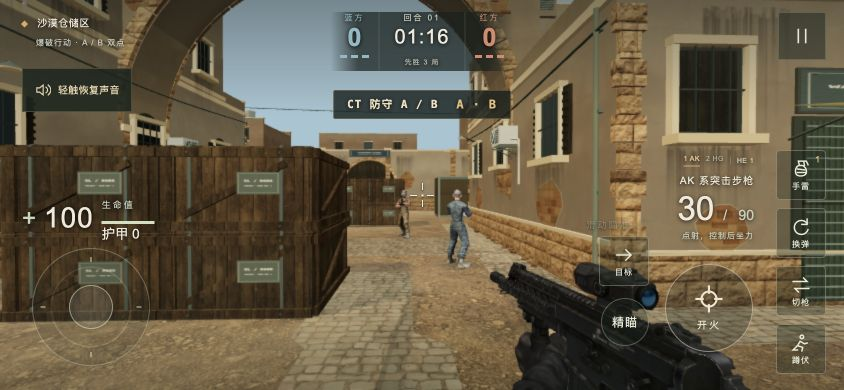
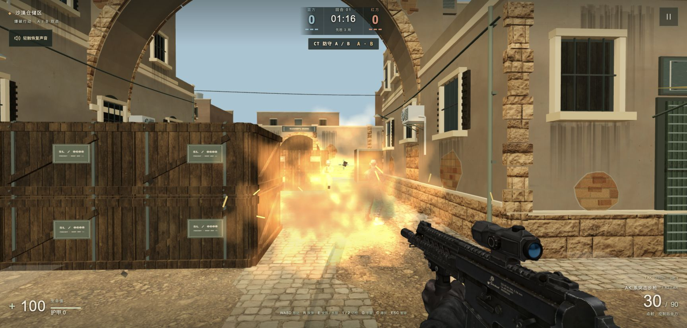
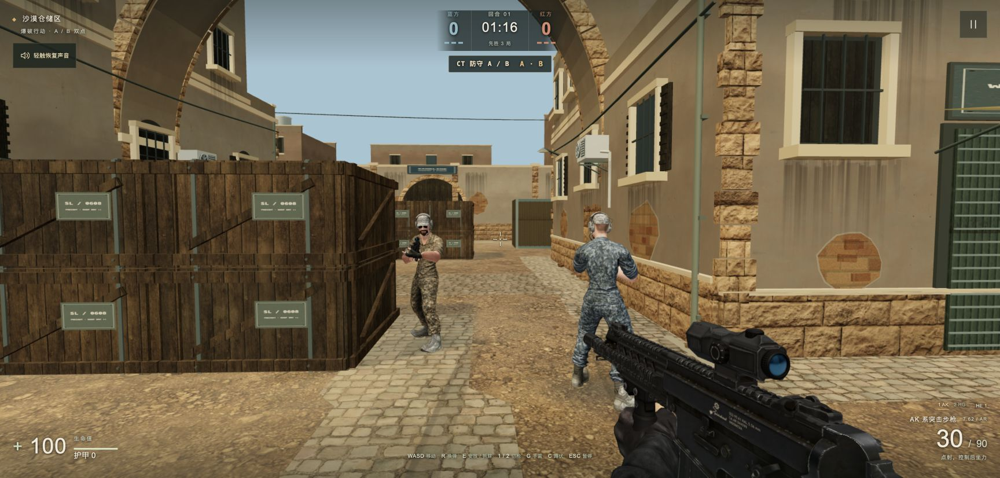

# SANDLINE — Three.js Browser FPS

**A tactical first-person shooter built with Three.js, playable in desktop and mobile browsers.**

**[Play the live demo](http://39.105.40.112/)** · **[Development journal](DEVLOG.md)**

No installation required. On mobile, rotate to landscape and open the demo in Chrome where available. The current game UI is Chinese, with short Mandarin voice callouts; this repository's documentation is in English.

> This is a public demo showcase: screenshots and development notes. Game source code and binary assets are not distributed here. See [NOTICE.md](NOTICE.md) for scope and credits.

## The game

- Single-player **3v3 tactical combat with bots**, two bomb sites, and a first-to-three-rounds match.
- Rifle and pistol, reloading, crouching, grenades, and bomb planting/defusing.
- Mobile touch controls: movement joystick, swipe aiming, and drag-to-aim on the fire button.
- Animated soldier models, cover-aware blast damage, layered explosions, and camera shake.
- Bot avoidance and path recovery, staged loading progress, and short objective/result voice callouts.

Built with **Three.js, TypeScript, Vite, and Rapier**, with custom combat, bot, grenade, and objective systems. This is a single-player prototype, not an online multiplayer game.

## Mobile controls

Use the left joystick to move and swipe on the right to aim. Hold the fire button to shoot; dragging it also adjusts aim. On-screen buttons handle reload, weapon switching, grenades, crouching, and objective interaction.

Desktop controls:

| Action | Input |
| --- | --- |
| Move | WASD / arrow keys |
| Aim / fire | Mouse / left button |
| Reload | R |
| Switch weapon | 1 / 2 |
| Throw grenade | G |
| Crouch | C |
| Plant / defuse | Hold E near the objective |
| Pause | Esc |

Fullscreen depends on the browser and operating system. Some iPhone and embedded browsers restrict it. WeChat's embedded browser may perform worse than a standalone browser; use Chrome where available. Browser viewport checks are not a substitute for testing on physical phones.

## Explosions: impact with a fixed budget

The effect combines a brief flash, noisy fireballs, an expanding ring, staggered smoke, debris, sparks, and a short-lived light. Each explosion has **34 visual elements**, with at most **two concurrent effects**. Procedural 64×64 textures keep the effect self-contained.

The biggest lesson: camera shake must be a temporary render offset. Adding shake back into the player's camera state causes drift. Blast damage and cover checks remain separate from the visual particles.

[Read the explosion development story →](DEVLOG.md#3-explosions-more-impact-without-unbounded-particles)

## Characters: a GLB is not necessarily an animated character

Two early character downloads looked usable in a preview but contained **no skins and no animation clips**. The final soldier asset has a 65-joint skeleton, but its single animation was not a complete locomotion set. Bringing over idle/walk/run animations required bind-pose-aware retargeting, independent skeletons, and transform validation.

[Read the GLB and animation development story →](DEVLOG.md#1-glb-models-preview-quality-is-not-animation-readiness)

## Development lessons

- **GLB imports:** inspect skinning and animation data before integrating; a convincing static preview can hide an unusable rig.
- **Mobile aiming:** preserve small accumulated movements and pending motion on pointer release so aim does not depend on frame rate.
- **Explosions:** time the layers, cap concurrency, clean up effects, and keep camera shake out of simulation state.
- **Mobile browser behavior:** handle unsupported fullscreen and prevent unintended zoom across both the canvas and HUD.
- **Bots:** collision separation alone cannot make two approaching teammates pass each other; steering must start before contact.
- **Audio:** unlock playback through a user gesture and discard stale announcements after pause/background transitions.

The [development journal](DEVLOG.md) explains the problems, fixes, and validation behind these lessons.

## Screenshots and validation

Screenshots are current **in-engine fixed capture scenes**, not performance footage. The mobile image is a browser viewport preview, not a physical-phone capture. Chinese text in screenshots reflects the current game UI.

The underlying project passed a production build and 67 automated tests covering gameplay and related systems during the latest validation. This showcase contains no runnable source or test suite; those results do not establish performance on every mobile device.

## Feedback

Please open a GitHub issue with your device, OS, browser version, steps to reproduce, and expected/actual behavior. A screenshot is helpful. The live demo also includes an in-game feedback entry.
